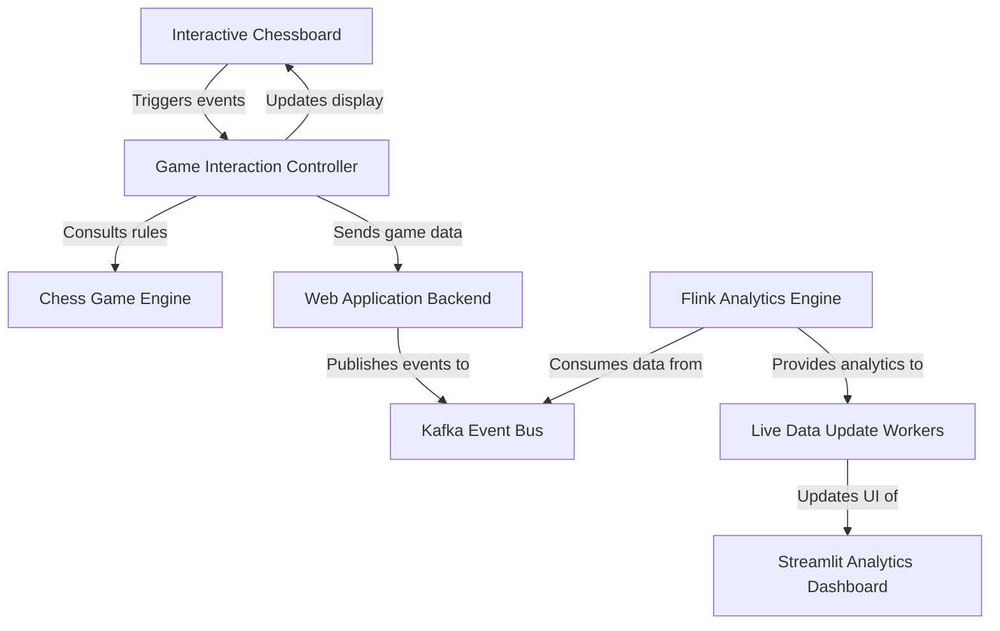
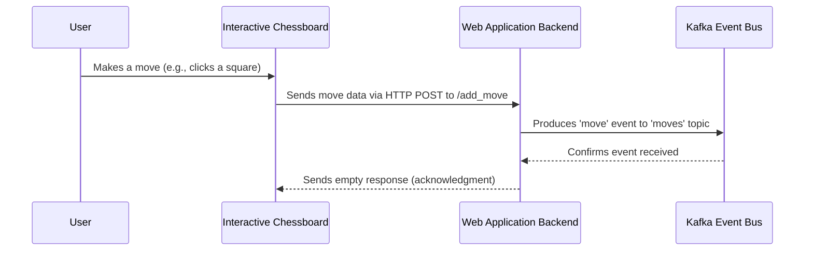
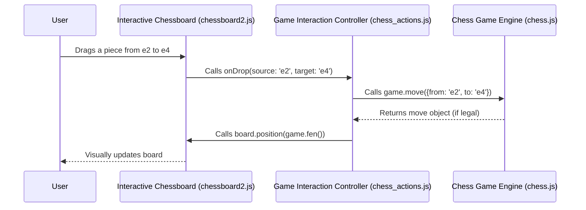
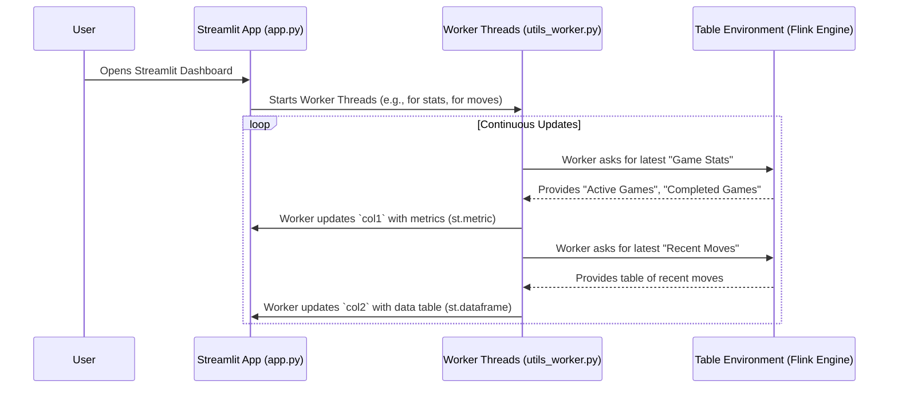
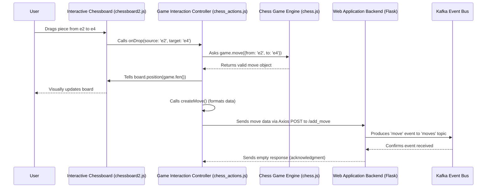
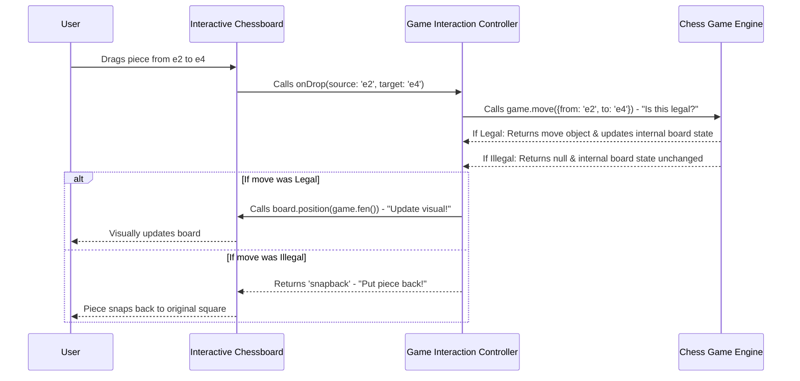
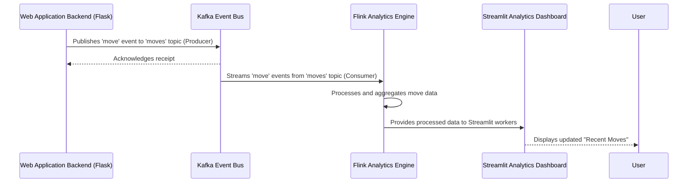
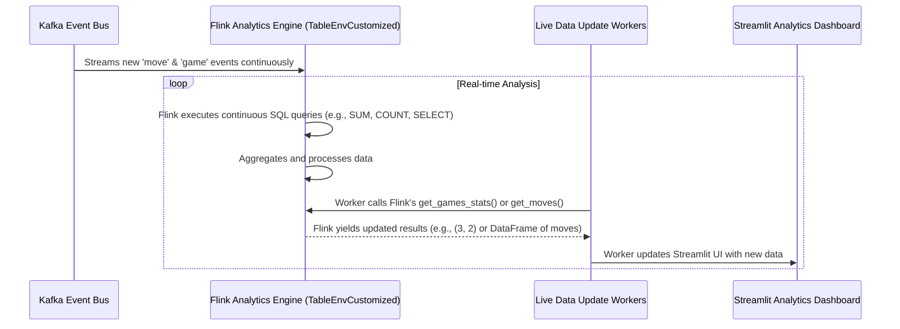
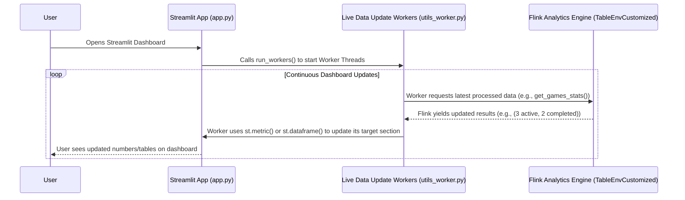

`kafka-chess` is a project that builds a **web-based chess game** with _real-time analytics_. Players interact with an _interactive chessboard_ via a web application, where every move and game event is published to a _Kafka event bus_. An _Apache Flink engine_ continuously processes these events to calculate live game statistics, which are then displayed on a dynamic _Streamlit dashboard_.


Interactive Chessboard


Streamlit Dashboard

**Source Repository:** [https://github.com/cyshen11/kafka-chess](https://github.com/cyshen11/kafka-chess)



<br>

## Tech Stack

- Frontend: Flask, Streamlit
- Database: Kafka
- Analytics Engine: Flink

<br>

## Getting Started

1. Clone the source repository: `git clone https://github.com/cyshen11/kafka-chess.git`.
2. Create a python environment and install the requirements.txt.
3. Run `flask --app flaskr run --debug` to run the interactive chessboard and navigate to 127.0.0.1:5000 to view it.
4. Change directory to Kafka `cd kafka` and run `docker compose up` to run the Kafka server in Docker container.
5. Change directory to parent level `cd ../`.
6. Run `streamlit run streamlit/app.py` to run the analytics dashboard and navigate to 127.0.0.1:8501 to view it.

<br>

## Chapters

1. [Web Application Backend
   ](#chapter-1-web-application-backend)
2. [Interactive Chessboard
   ](#chapter-2-interactive-chessboard)
3. [Streamlit Analytics Dashboard
   ](#chapter-3-streamlit-analytics-dashboard)
4. [Game Interaction Controller
   ](#chapter-4-game-interaction-controller)
5. [Chess Game Engine
   ](#chapter-5-chess-game-engine)
6. [Kafka Event Bus
   ](#chapter-6-kafka-event-bus)
7. [Flink Analytics Engine
   ](#chapter-7-flink-analytics-engine)
8. [Live Data Update Workers
   ](#chapter-8-live-data-update-workers)

---

<br>

# Chapter 1: Web Application Backend

Welcome to `kafka-chess`! In this project, we're building a complete chess game that uses some really powerful tools. Think of it like building a complex machine: it has many different parts, and each part has a specific job.

This first chapter introduces you to the **Web Application Backend**. Imagine you're playing chess on your computer. You open your web browser, and _poof!_ a chessboard appears. You click on a pawn, and it moves. How does all of this happen? That's exactly what the Web Application Backend helps to manage!

<br>

## What is the Web Application Backend?

At its heart, the Web Application Backend is like the **control center** for your entire web experience. It has two main jobs:

1.  **Serving the Webpage:** It's responsible for showing you the `index.html` page, which is where you see the chessboard and all the game controls. Think of it as the restaurant that gives you the menu.
2.  **Receiving Your Actions:** When you make a move, click a button, or surrender in the game, your web browser needs a way to tell the "brain" of the application what you did. The backend provides special "API endpoints" (like different phone numbers for different departments) where your browser can send this information.

But it does one more very important thing: it acts like a **post office**. When you make a move, the backend doesn't try to figure out if it's a legal move or what the new board position should be. Instead, it simply takes the information about your move and sends it off to a special "mail system" called Kafka. This allows other parts of our chess system to pick up these "letters" (game events) and process them in real-time.

<br>

### Use Case: Making a Chess Move

Let's use a simple example: You, the player, move a pawn on the screen. How does the Web Application Backend help make this happen?

1.  You interact with the chessboard in your browser.
2.  Your browser (the "frontend") tells the backend, "Hey, I just moved a piece from square 'e2' to 'e4'!"
3.  The backend receives this message.
4.  Instead of processing the move itself, the backend immediately sends this move information into our "mail system" (Kafka) so other components can react to it.

This process ensures that the backend is fast and efficient, simply passing along information to where it needs to go.

<br>

## How the Backend Works (Simplified)

Let's break down how the backend fulfills its role. We use a Python tool called **Flask** to build our web application.

<br>

### 1. Showing You the Chessboard

When you visit the website, the backend's first job is to show you the main chess game page. This is handled by a function that "routes" requests to the correct page.

```python
# In flaskr/__init__.py
from flask import Flask, render_template

def create_app(test_config=None):
    app = Flask(__name__, instance_relative_config=True)
    # ... (other setup code)

    @app.route("/") # This means "when someone visits the main page /"
    def main():
        # This sends the 'index.html' file to the user's browser
        return render_template("index.html", move={})

    return app
```

In this code:

- `app = Flask(__name__, ...)` creates our web application.
- `@app.route("/")` is like setting up a street sign that says "If you're looking for the main page, come this way!"
- `def main():` is the function that runs when someone visits that main page.
- `return render_template("index.html", ...)` tells Flask to send the `index.html` file (which contains all the HTML, CSS, and JavaScript for our chessboard) to your web browser. This is how you see the game!

<br>

### 2. Setting Up the "Post Office" (Kafka Producer)

Before the backend can send messages to Kafka, it needs a way to connect. This is done by creating a `Producer` object, which is like setting up a connection to the main post office.

```python
# In flaskr/__init__.py
from confluent_kafka import Producer

KAFKA_SERVER = "localhost:9092" # Where our Kafka "post office" is located

# Set up connection details for the producer
config = {
    "bootstrap.servers": KAFKA_SERVER,
    "acks": "all", # Make sure messages are safely delivered
}

# Create the Producer instance
producer = Producer(config)
```

Here:

- We import `Producer` from `confluent_kafka`, which is a library that helps Python talk to Kafka.
- `KAFKA_SERVER` tells our producer where to find the Kafka system (usually on `localhost:9092` if you're running it on your own computer).
- `producer = Producer(config)` creates the actual "post office worker" object that will send our messages.

<br>

### 3. Receiving Your Moves and Sending Them to Kafka

Now, let's see how the backend receives your move and sends it off.

First, on the **frontend** (the JavaScript code running in your web browser), when you make a move, a function is called to send that information to our backend:

```javascript
// In flaskr/static/js/chess_actions.js (simplified)

function createMove() {
  const lastMove = game.history({ verbose: true })[0]; // Get details of the last move
  const key = uuid.v4(); // Generate a unique ID for this move
  const value =
    '"' +
    key +
    '","' +
    sessionStorage.getItem("gameId") +
    '","' +
    "Player" +
    '","' +
    "Pawn from e2 to e4" +
    '","' + // Example move details
    toISOStringLocal(new Date()) +
    '"'; // When the move happened

  console.log(value);
  // Send the move data to the backend's /add_move API endpoint
  axios.post("http://127.0.0.1:5000/add_move/" + key + "/" + value);
}
```

This JavaScript code uses `axios.post` to send an HTTP POST request to our Flask backend. It sends the `key` (a unique ID for the move) and `value` (details about the move) as part of the web address.

Next, on the **backend** side, Flask has another route that is specifically designed to listen for these `add_move` requests:

```python
# In flaskr/__init__.py (simplified)

@app.route("/add_move/<key>/<value>", methods=["POST"])
def add_move(key, value):
    topic = "moves" # We send chess moves to the 'moves' topic

    # Use our Kafka producer to send the message
    producer.produce(topic, value, key, on_delivery=delivery_callback)

    # Make sure the message is sent before continuing
    producer.poll(10000)
    producer.flush()

    return "" # Send an empty response back to the frontend
```

Here's what happens step-by-step:

- `@app.route("/add_move/<key>/<value>", methods=["POST"])` sets up another "street sign." This one says, "If you're sending a POST request to `/add_move` with a `key` and `value`, come this way!"
- `def add_move(key, value):` is the function that runs when your browser sends a move. The `key` and `value` from the browser are passed directly into this function.
- `topic = "moves"`: Kafka uses "topics" to organize messages, like different departments in a post office. All chess moves go into the `moves` topic.
- `producer.produce(topic, value, key, ...)` is the crucial line! This tells our "post office worker" (`producer`) to send the `value` (the move details) to the `topic` (`moves`), using the `key` as an identifier. `on_delivery=delivery_callback` is just a way to check if the message was delivered successfully.
- `producer.poll()` and `producer.flush()` ensure that the message is actually sent out immediately.

There's also a similar endpoint, `/add_game`, which works in the same way to send information about when a game starts or ends to a different Kafka topic called `games`.

<br>

## Internal Workflow

Let's visualize the simplified interaction when you make a move:



In this flow:

1.  **User makes a move:** You interact with the visual chessboard.
2.  **Frontend sends move data:** The JavaScript code on your webpage detects the move and uses `axios.post` to send the details to the backend's `/add_move` endpoint.
3.  **Backend produces event to Kafka:** The `add_move` function in Flask receives the move data. It doesn't process the game logic itself; instead, it uses the `producer` to send this raw move information into the "moves" topic within Kafka.
4.  **Kafka confirms receipt:** Kafka acknowledges that it has received the message.
5.  **Backend responds to Frontend:** The backend sends a simple "OK" (an empty response) back to the frontend, letting the browser know the message was received.

This design makes the backend very lightweight and efficient, as its main job is just to route information quickly!

<br>

## Conclusion

You've now learned about the **Web Application Backend**, which is the "control center" that serves our chess webpage, listens for your actions (like making a move), and acts as a "post office" to send these actions to Kafka for further processing. This allows our backend to stay fast and focused on getting information where it needs to go.

Next up, we'll dive into the [Interactive Chessboard](02_interactive_chessboard_.md) itself, to see how the web page handles your clicks and displays the game!

---

<br>

# Chapter 2: Interactive Chessboard

Welcome back! In [Chapter 1: Web Application Backend](01_web_application_backend_.md), we learned how our backend serves the `index.html` page to your web browser and acts as a "post office" for game events. But once that `index.html` page loads, how does the actual chessboard appear? How do you interact with it, dragging and dropping pieces? That's where the **Interactive Chessboard** comes in!

<br>

## What is the Interactive Chessboard?

Imagine the chessboard you see on your screen. It's not just a static image; it's a dynamic playground where you move pieces around. The **Interactive Chessboard** is the part of our system responsible for making this visual experience possible.

Its main jobs are:

1.  **Drawing the Board and Pieces:** It's like the artist who paints the chessboard, draws all the pawns, knights, and kings, and places them in their starting positions.
2.  **Listening to Your Actions:** When you click a square, drag a piece, or tap your screen, the Interactive Chessboard detects these actions.
3.  **Translating Actions into Events:** It doesn't know the rules of chess (like if a knight can jump over pieces). Instead, it's like a messenger that tells another part of our system, "Hey, the user just tried to move a piece from square 'e2' to 'e4'!"

The `chessboard2.js` library is the specific tool we use to create this interactive visual element. It's the "front-end" part that runs directly in your web browser.

<br>

### Use Case: Moving a Chess Piece Visually

Let's use our familiar example: You, the player, want to move a pawn on the screen. How does the Interactive Chessboard make this visual interaction happen?

1.  You drag a pawn from `e2` to `e4` with your mouse.
2.  The `chessboard2.js` library detects this "drag and drop" action.
3.  It then calls a special function (a "callback") that _we_ provide, telling it, "A piece was dropped from 'e2' to 'e4'!"
4.  Our special function (which lives in `chess_actions.js`, covered in a later chapter) then checks if this is a legal move using the [Chess Game Engine](05_chess_game_engine_.md).
5.  If it's legal, our function tells `chessboard2.js` to update its display to show the pawn now on `e4`.

Notice a key point: `chessboard2.js` is only concerned with _showing_ things and _reporting_ user interactions. It doesn't know the game rules itself. It relies on other parts of our system to tell it what to display.

<br>

## How the Interactive Chessboard Works (Simplified)

The `chessboard2.js` library is initialized and configured directly within your `index.html` file, using JavaScript code.

<br>

### 1. Setting Up the Visual Board

When the `index.html` page loads in your browser, JavaScript code runs to create the chessboard.

```html
<!-- In flaskr/templates/index.html (simplified) -->
<div id="myBoard" style="width: 400px; margin: 20px 0;"></div>

<script>
  // ... (other setup code)

  // Chessboard Configuration
  const boardConfig = {
    draggable: true, // Allow piece dragging
    onDragStart, // Function called when drag starts
    onTouchSquare, // Function for touch/click interactions
    onDrop, // Function called when piece is dropped
    onSnapEnd, // Function called after piece animation ends
    position: game.fen(), // Set initial board position from game state
    touchMove: true, // Enable touch-based moves on mobile
  };

  // Initialize the visual chessboard in the myBoard div
  const board = Chessboard2("myBoard", boardConfig);
  // ... (more code)
</script>
```

In this snippet:

- The `<div id="myBoard"></div>` is a placeholder on your webpage where the chessboard will be drawn.
- `boardConfig` is an object (like a shopping list) that tells `chessboard2.js` how we want our board to behave.

  - `draggable: true` means you can pick up pieces.
  - `position: game.fen()` tells `chessboard2.js` the current state of the game board using a special code called FEN (which the [Chess Game Engine](05_chess_game_engine_.md) understands).
  - `onDragStart`, `onTouchSquare`, `onDrop`, and `onSnapEnd` are **callback functions**. These are functions _we write_ in another file (`chess_actions.js`, as you'll see in [Chapter 4: Game Interaction Controller](04_game_interaction_controller_.md)). `chessboard2.js` will call these functions when a user performs a specific action (like starting a drag or dropping a piece).

- `const board = Chessboard2('myBoard', boardConfig)` is the line that actually creates the chessboard! It tells the `chessboard2.js` library: "Hey, draw a chessboard inside the `div` with the ID 'myBoard', and use these `boardConfig` settings."

<br>

### 2. Reacting to Your Visual Moves

When you drag and drop a piece, `chessboard2.js` doesn't know if it's a legal chess move. It just reports the action. It calls the `onDrop` function (which we defined in `chess_actions.js`).

Let's look at a simplified `onDrop` function:

```javascript
// In flaskr/static/js/chess_actions.js (simplified)

function onDrop(dropEvt) {
  // 1. Try to make the move using the Chess Game Engine (chess.js)
  const move = game.move({
    from: dropEvt.source, // Where the piece came from (e.g., 'e2')
    to: dropEvt.target, // Where the piece was dropped (e.g., 'e4')
    promotion: "q", // (simplified) always promote to a Queen
  });

  // 2. If the move was legal (chess.js returned a result)
  if (move) {
    // 3. Tell chessboard2.js to update its visual position
    board.position(game.fen()).then(() => {
      // 4. Update other game elements (like move history)
      updatePGN();
      updateStatus();

      // 5. (Later chapters) send move to backend for Kafka
      createMove(); // Sends move to Flask backend (Chapter 1)

      // Make a random move for the AI (for single-player demo)
      window.setTimeout(makeRandomMove, 250);
    });
  } else {
    // If the move was illegal, snap the piece back to its original square
    return "snapback";
  }
}
```

In this code:

- The `onDrop` function receives `dropEvt` (an event object) from `chessboard2.js`. This object contains `source` (the starting square) and `target` (the ending square).
- `game.move(...)` is a function from the [Chess Game Engine](05_chess_game_engine_.md) (`chess.js`). This is where the _actual chess rules_ are checked.
- If `game.move()` returns a valid `move` (meaning the move was legal), then:
  - `board.position(game.fen())` tells `chessboard2.js` to redraw the board to the _new_ game state (provided by `game.fen()`). This visually updates the board.
  - `updatePGN()` and `updateStatus()` update the text you see on the page.
  - `createMove()` (as we saw in [Chapter 1: Web Application Backend](01_web_application_backend_.md)) sends the move data to our Flask backend, which then pushes it to Kafka.

<br>

## Internal Workflow

Let's visualize the steps involved when you interact with the chessboard:



In this flow:

1.  **User Interacts:** You physically drag a chess piece on the screen.
2.  **Interactive Chessboard Detects:** `chessboard2.js` detects this interaction and figures out which squares were involved.
3.  **Calls Callback:** `chessboard2.js` calls the `onDrop` function, passing details of the move attempt.
4.  **Game Logic:** The `onDrop` function (in `chess_actions.js`) uses the `game` object (from `chess.js`) to check if the move is legal and to update the actual game state.
5.  **Visual Update:** If the move is valid, the `onDrop` function tells `chessboard2.js` to update its visual display to reflect the new board position.

This separation of concerns is powerful: `chessboard2.js` focuses on the "graphics" and user input, while `chess.js` handles the "brain" (game rules). Our `chess_actions.js` acts as the bridge between them, as you'll learn more about in [Chapter 4: Game Interaction Controller](04_game_interaction_controller_.md).

<br>

## Conclusion

You've now seen how the **Interactive Chessboard** (powered by `chessboard2.js`) provides the visual interface for our chess game. It handles drawing the board and pieces, and, crucially, it acts as the primary listener for your interactions, passing those "events" to our custom JavaScript functions. This allows us to keep the visual display separate from the actual game logic.

Next up, we'll shift gears and look at how we visualize and analyze game data using a tool called [Streamlit Analytics Dashboard](03_streamlit_analytics_dashboard_.md).

---

<br>

# Chapter 3: Streamlit Analytics Dashboard

Welcome back! In [Chapter 1: Web Application Backend](01_web_application_backend_.md), we learned how our chess system handles sending messages about moves to Kafka. Then, in [Chapter 2: Interactive Chessboard](02_interactive_chessboard_.md), we saw how the chessboard appears in your browser and lets you interact with it.

Now, imagine we have many people playing chess on our platform. We're collecting all these moves and game starts/ends. But how can we _see_ what's happening across all games? How many games are active right now? What are the most recent moves being played? We need a way to **display and understand** this information easily.

<br>

## What is the Streamlit Analytics Dashboard?

The **Streamlit Analytics Dashboard** is like a "control panel" or a "TV screen" for our `kafka-chess` project. Its main job is to **show you the important numbers and recent activities** from all the chess games being played. Instead of just playing a single game, this dashboard lets you observe the bigger picture.

It acts as the **main user interface for observing game trends**. It uses a tool called **Streamlit** to create a web-based dashboard that is visually organized to present game statistics and a live feed of recent moves. This makes insights from our data (which is processed by the [Flink Analytics Engine](07_flink_analytics_engine_.md), covered later) accessible and easy to understand.

<br>

### Use Case: Monitoring Live Chess Game Trends

Let's say you're the person running the `kafka-chess` platform, or just a curious user. You want to quickly answer questions like:

- How many chess games are currently happening?
- How many total players have joined?
- What were the last few moves made across _any_ game?

The Streamlit Analytics Dashboard solves this by providing a simple webpage that constantly updates with these answers.

<br>

## How the Dashboard Works (Simplified)

The core of our dashboard is the `app.py` script located in the `streamlit` directory. This script uses the Streamlit library to build a webpage that looks nice and shows data.

<br>

### 1. Setting Up the Web Page Layout

First, `app.py` tells Streamlit how the web page should look. It sets a title and divides the page into sections, like arranging furniture in a room.

```python
# In streamlit/app.py (simplified)
import streamlit as st

# Configure the Streamlit page layout and metadata
st.set_page_config(page_title="Chess Analytics", page_icon="♟️", layout="wide")
st.title("♟️ Chess Web App Analytics")
st.write("Built with Streamlit and PyFlink")

# Create main content columns - col1 for stats, col2 for moves
col1, col2 = st.columns([1, 2])
col1.subheader("📊 Game Statistics")
col2.subheader("🔄 Recent Moves")

# ... (more code for data workers)
```

In this code:

- `import streamlit as st` brings in the Streamlit library.
- `st.set_page_config(...)` sets up basic things like the tab title in your browser and the overall layout.
- `st.title(...)` puts a big title at the top of our page.
- `st.columns([1, 2])` is a powerful command! It creates two "columns" on our webpage. The `[1, 2]` means the second column (`col2`) will be twice as wide as the first (`col1`). We then give each column its own subheader (`col1.subheader`, `col2.subheader`) to label its content.

<br>

### 2. Getting and Displaying Live Data

The dashboard needs to constantly update with new information. It doesn't just show a static picture; it's like a live news feed. To do this, we have special "worker threads" (imagine them as small, independent reporters) that constantly fetch data and update specific parts of the dashboard.

The `app.py` script starts these workers:

```python
# In streamlit/app.py (simplified)
from utils.utils_table_env import TableEnvCustomized
from utils.utils_worker import run_workers

# ... (page layout code)

# Initialize PyFlink table environment for data processing
table_env = TableEnvCustomized()
table_env.create_source_tables() # Set up connections to data sources

# Start the data processing workers
try:
    run_workers(col1, col2, col3, col4, table_env)
except Exception:
    st.info("Unable to fetch live data.")
```

Here:

- `TableEnvCustomized()` is setting up the connection to our data processing engine ([Flink Analytics Engine](07_flink_analytics_engine_.md)). Think of `TableEnvCustomized()` as the "data manager" that knows how to ask for processed game information.
- `run_workers(...)` is the key function that kicks off all our "reporter" threads. It tells them which "column" on the Streamlit page they should update (`col1`, `col2`, etc.) and gives them the `table_env` so they can ask for data.

<br>

## Internal Workflow

Let's visualize how the dashboard gets and displays its live information:



In this flow:

1.  **User Opens Dashboard:** You navigate to the Streamlit app in your web browser.
2.  **Streamlit App Starts Workers:** The `app.py` script runs, sets up the page, and then calls `run_workers` to start background tasks.
3.  **Workers Request Data:** These "worker threads" (defined in `utils_worker.py`) constantly ask the `Table Environment` (which represents the [Flink Analytics Engine](07_flink_analytics_engine_.md)'s processed data) for the latest statistics or recent moves.
4.  **Flink Provides Data:** The `Table Environment` sends back the processed data (e.g., "3 active games," "a list of 5 recent moves").
5.  **Workers Update Dashboard:** Each worker then takes its data and uses Streamlit commands (`st.metric`, `st.dataframe`) to update the specific sections of the web page it's responsible for. This happens continuously, giving you a live view!

<br>

### Diving into the Worker Code

Let's look at a simplified example of one of these "reporter" worker threads from `streamlit/utils/utils_worker.py`.

Here's `WorkerThread1`, which handles displaying game statistics:

```python
# In streamlit/utils/utils_worker.py (simplified)
import streamlit as st
from threading import Thread # For running tasks in the background

class WorkerThread1(Thread):
    """Worker thread for displaying game statistics metrics."""

    def __init__(self, delay, target, table_env):
        super().__init__()
        self.delay = delay
        self.target = target # This is a Streamlit column (e.g., col1)
        self.table_env = table_env # Our data manager

    def run(self):
        """Execute the worker thread to display game statistics."""
        # Initial delay to let other things start
        time.sleep(self.delay)

        # Ask the data manager for the game stats stream
        stream = self.table_env.get_games_stats()

        # Loop forever, getting new data as it comes in
        for chunk in stream:
            # Use the target column to display the data
            with self.target.container():
                # Display metrics like "Active Games"
                st.metric("Active Games", chunk[0])
                st.metric("Games Completed Today", chunk[1])
```

Explanation:

- `class WorkerThread1(Thread):` means this is a special kind of task that can run in the background without freezing the rest of our app.
- `self.target` is the `col1` (or similar) Streamlit object we passed to it.
- `self.table_env.get_games_stats()` is where this worker asks the [Flink Analytics Engine](07_flink_analytics_engine_.md) for the live game statistics.
- `for chunk in stream:` This loop is crucial! It continuously waits for _new_ data to arrive from Flink. As soon as Flink sends updated stats, this loop gets a `chunk` of data.
- `with self.target.container():` ensures that whatever we display (`st.metric`) appears inside the specific column (`col1`) assigned to this worker.
- `st.metric("Active Games", chunk[0])` displays a nice, big number (a "metric") labeled "Active Games" using the first piece of data (`chunk[0]`) from Flink.

Similarly, `WorkerThread2` is responsible for showing the "Recent Moves" table:

```python
# In streamlit/utils/utils_worker.py (simplified)
# ... (imports and other worker classes)

class WorkerThread2(Thread):
    """Worker thread for displaying chess moves data table."""

    def __init__(self, delay, target, table_env):
        super().__init__()
        self.delay = delay
        self.target = target
        self.table_env = table_env

    def run(self):
        """Execute the worker thread to display moves data."""
        time.sleep(self.delay)
        stream = self.table_env.get_moves() # Get stream of recent moves

        for chunk in stream:
            # Display moves data as a scrollable dataframe
            self.target.container().dataframe(chunk, height=400)
```

Here:

- `self.table_env.get_moves()` asks Flink for the list of recent moves.
- `self.target.container().dataframe(chunk, height=400)` takes the received `chunk` (which is a table of move data) and displays it nicely as a scrollable table within `col2` on the dashboard.

Finally, the `run_workers` function brings it all together:

```python
# In streamlit/utils/utils_worker.py (simplified)
# ... (worker classes)
from streamlit.runtime.scriptrunner_utils.script_run_context import (
    add_script_run_ctx, get_script_run_ctx,
)

def run_workers(col1, col2, col3, col4, table_env):
    """Initialize and start all worker threads for the Streamlit dashboard."""
    threads = [
        WorkerThread1(1.2, col1.empty(), table_env), # Stats worker for col1
        WorkerThread2(1.1, col2.empty(), table_env), # Moves worker for col2
        # WorkerThread3 (disabled for now)
        WorkerThread4(1.3, col4.empty()),           # Timestamp worker for col4
    ]

    # Start all threads
    for thread in threads:
        # Crucial: this allows threads to update the Streamlit page
        add_script_run_ctx(thread, get_script_run_ctx())
        thread.start()

    # Wait for all threads to complete (they run forever in this case)
    for thread in threads:
        thread.join()
```

This `run_workers` function:

- Creates instances of our `WorkerThread` reporters, giving them their specific `col` (where to display) and `table_env` (where to get data). `col1.empty()` creates a placeholder in that column that the worker can continuously update.
- The `add_script_run_ctx(...)` line is important technical glue for Streamlit: it tells Streamlit that these background threads are allowed to update the web page. Without it, Streamlit wouldn't let the threads change what's on the screen.
- `thread.start()` actually starts each reporter thread running in the background.
- `thread.join()` makes the main program wait for these threads, effectively keeping the dashboard running.

<br>

## Conclusion

You've now learned about the **Streamlit Analytics Dashboard**. It's our real-time "control panel" built with Streamlit, showing live statistics and recent moves from our chess games. We saw how `app.py` sets up the page layout, and how "worker threads" in `utils_worker.py` continuously fetch processed data from the [Flink Analytics Engine](07_flink_analytics_engine_.md) to keep the dashboard updated. This provides a clear, visual way to understand what's happening across our `kafka-chess` system.

Next, we'll dive into the [Game Interaction Controller](04_game_interaction_controller_.md), which acts as the "middleman" between your clicks on the chessboard and the game's core logic.

---

<br>

# Chapter 4: Game Interaction Controller

Welcome back! In [Chapter 2: Interactive Chessboard](02_interactive_chessboard_.md), we explored how the `chessboard2.js` library draws the board and lets you click or drag pieces. We also touched on how it sends signals (like `onDrop` or `onTouchSquare`) when you interact. Then, in [Chapter 1: Web Application Backend](01_web_application_backend_.md), we learned how our Flask backend acts as a "post office," ready to receive these game events and send them to Kafka.

But there's a missing piece! When you drag a piece on the visual board, how does the system know if it's a _legal_ chess move? And if it is, how does that legal move get communicated to the backend to be sent to Kafka?

This is where the **Game Interaction Controller** comes in! Think of it as the "player's assistant" or the "traffic cop" for your chess moves.

<br>

## What is the Game Interaction Controller?

The Game Interaction Controller (GIC) is like the **central coordinator** for your live chess game. It's not the one drawing the board, and it doesn't know all the chess rules by itself. Instead, its main jobs are:

1.  **Interpreting Your Actions:** It receives raw interactions from the visual chessboard (like "piece moved from E2 to E4").
2.  **Consulting the Rulebook:** It asks the real chess "brain" (the [Chess Game Engine](05_chess_game_engine_.md)) if your proposed move is legal.
3.  **Updating the World:** If the move is legal, it tells the visual chessboard to update its display, updates other parts of the game (like showing "checkmate!"), and, crucially, tells the [Web Application Backend](01_web_application_backend_.md) to send the move information to Kafka.

The `chess_actions.js` file is where this "assistant" lives. It's a JavaScript file that connects all the pieces of our frontend chess game.

<br>

### Use Case: Making a Valid Chess Move

Let's use our familiar example: You, the player, try to move a pawn from `e2` to `e4`. How does the Game Interaction Controller manage this?

1.  You drag the pawn visually on the board.
2.  The [Interactive Chessboard](02_interactive_chessboard_.md) (`chessboard2.js`) detects this and calls the `onDrop` function (which is part of our Game Interaction Controller in `chess_actions.js`).
3.  The Game Interaction Controller takes the `e2` and `e4` information and asks the [Chess Game Engine](05_chess_game_engine_.md) (`chess.js`), "Is moving a pawn from `e2` to `e4` a legal move right now?"
4.  The [Chess Game Engine](05_chess_game_engine_.md) checks its rules and says, "Yes, that's a legal move!"
5.  The Game Interaction Controller then:
    - Tells the visual board (`chessboard2.js`) to _permanently_ show the pawn on `e4`.
    - Updates the text on the screen (like "White to move" or "Check!").
    - Tells the [Web Application Backend](01_web_application_backend_.md) to record this move by sending it to Kafka.

If the move wasn't legal (e.g., trying to move a pawn sideways), the Game Interaction Controller would tell the visual board to "snap back" the piece to its original square.

<br>

## How the Game Interaction Controller Works (Simplified)

The `chess_actions.js` file contains various functions that act as the Game Interaction Controller. These functions are often "callback" functions that the `chessboard2.js` library calls when a user interacts.

<br>

### 1. Connecting to the "Chess Brain" and "Visual Board"

At the very start of our `index.html` file, we initialize the `Chess` game object and the `Chessboard2` visual board:

```javascript
// In flaskr/templates/index.html (inside <script> tags)

// Create new chess game instance using chess.js library
const game = new Chess(); // This is our Chess Game Engine!

// Chessboard Configuration
const boardConfig = {
  draggable: true, // Allow piece dragging
  onDragStart, // Function called when drag starts
  onDrop, // Function called when piece is dropped
  // ... other callbacks
};

// Initialize the visual chessboard
const board = Chessboard2("myBoard", boardConfig); // This is our Interactive Chessboard!
```

Here:

- `const game = new Chess();` creates an object that understands all the rules of chess. This is our direct link to the [Chess Game Engine](05_chess_game_engine_.md).
- `const board = Chessboard2('myBoard', boardConfig)` creates the visual board. Notice `onDragStart` and `onDrop` are listed in `boardConfig`. These tell `chessboard2.js` _which functions to call_ in `chess_actions.js` when the user drags or drops a piece. The `board` object also has functions like `board.position()` that the GIC will use to update the visual board.

<br>

### 2. Processing a Drag-and-Drop Move (`onDrop`)

When you drag a piece and drop it, `chessboard2.js` calls the `onDrop` function in `chess_actions.js`.

```javascript
// In flaskr/static/js/chess_actions.js (simplified)

function onDrop(dropEvt) {
  // 1. Try to make the move using the Chess Game Engine (chess.js)
  const move = game.move({
    from: dropEvt.source, // Where the piece came from (e.g., 'e2')
    to: dropEvt.target, // Where the piece was dropped (e.g., 'e4')
    promotion: "q", // (for simplicity) always promote to a Queen
  });

  // 2. If the move was legal (chess.js returned a result)
  if (move) {
    // 3. Tell chessboard2.js to update its visual position
    board.position(game.fen()).then(() => {
      // 4. Update other game elements (like move history & status)
      updatePGN();
      updateStatus();

      // 5. Send the valid move to the backend for Kafka
      createMove(); // Sends move to Flask backend (Chapter 1)

      // Make AI move (for demo purposes)
      window.setTimeout(makeRandomMove, 250);
    });
  } else {
    // If the move was illegal, snap the piece back to its original square
    return "snapback";
  }
}
```

Let's break down this simplified `onDrop` function:

- `function onDrop (dropEvt)`: This function is called by `chessboard2.js`. It receives `dropEvt`, which contains details like `dropEvt.source` (the starting square like 'e2') and `dropEvt.target` (the ending square like 'e4').
- `game.move(...)`: This is the crucial line! It asks the [Chess Game Engine](05_chess_game_engine_.md) (`chess.js`) if the move from `dropEvt.source` to `dropEvt.target` is valid. If it is, `game.move()` makes the move internally and returns information about it. If it's _not_ valid, it returns `null`.
- `if (move)`: This checks if the move was legal.
  - If `true` (legal):
    - `board.position(game.fen())`: The GIC tells the `board` object (our [Interactive Chessboard](02_interactive_chessboard_.md)) to redraw itself to match the _new_ state of the `game` (represented by `game.fen()`, a special chess notation).
    - `updatePGN()` and `updateStatus()`: These (other functions in `chess_actions.js`) update the text on the page, like the move history or game status.
    - `createMove()`: This function, also part of `chess_actions.js`, is called to send the move data to our [Web Application Backend](01_web_application_backend_.md), which then sends it to Kafka.
  - If `false` (illegal): `return 'snapback'` tells `chessboard2.js` to visually return the piece to its original square.

<br>

### 3. Sending the Move to the Backend (`createMove`)

The `createMove` function is the part of the Game Interaction Controller that talks to our Flask backend.

```javascript
// In flaskr/static/js/chess_actions.js (simplified)

function createMove() {
  const moves = game.history({ verbose: true });
  const lastMove = moves[moves.length - 1]; // Get details of the very last move

  const key = uuid.v4(); // Generate a unique ID for this move
  const player = lastMove.color == "w" ? "Player" : "AI"; // Who made the move?
  const moveDetails = `${getPieceName(lastMove.piece)} from ${
    lastMove.from
  } to ${lastMove.to}`; // Formatted move

  // Construct the data to send (as a string, simple for this example)
  const value =
    '"' +
    key +
    '","' +
    sessionStorage.getItem("gameId") +
    '","' +
    player +
    '","' +
    moveDetails +
    '","' +
    toISOStringLocal(new Date()) +
    '"';

  console.log(value);
  // Send the move data to the backend's /add_move API endpoint using Axios
  axios.post("http://127.0.0.1:5000/add_move/" + key + "/" + value);
}
```

Here:

- `const lastMove = ...`: We get the details of the move that _just happened_ from the `game` object (our [Chess Game Engine](05_chess_game_engine_.md)).
- `const key = uuid.v4();`: A unique ID is generated for each move.
- `const value = ...`: The GIC formats all the important details about the move (game ID, player, move description, timestamp) into a single string. This is the "letter" we're going to send.
- `axios.post(...)`: This line sends an HTTP POST request to our [Web Application Backend](01_web_application_backend_.md). It calls the `/add_move` endpoint we saw in [Chapter 1: Web Application Backend](01_web_application_backend_.md), passing the `key` and `value` of the move. The backend then takes this information and publishes it to Kafka.

There's also an `onTouchSquare` function that handles moves made by clicking squares instead of dragging. Its logic is a bit more complex as it manages "pending moves" (where you click a piece, then click a destination square), but it follows the same core idea: ask `game.move()` for legality, then update `board.position()` and call `createMove()`.

<br>

## Internal Workflow

Let's visualize the full journey of a legal move with the Game Interaction Controller acting as the central hub:



In this flow:

1.  **User Interacts:** You drag a piece on the visual chessboard.
2.  **Interactive Chessboard Notifies:** `chessboard2.js` detects the drag-and-drop and calls the `onDrop` function in the Game Interaction Controller.
3.  **Game Interaction Controller Consults Engine:** The `onDrop` function immediately asks the `game` object (the [Chess Game Engine](05_chess_game_engine_.md)) if the move is legal.
4.  **Engine Responds:** The [Chess Game Engine](05_chess_game_engine_.md) checks its rules and confirms the move is legal, returning a `move` object.
5.  **GIC Updates Visuals:** Because the move is legal, the Game Interaction Controller tells `chessboard2.js` to visually update the board with `board.position(game.fen())`.
6.  **GIC Prepares for Backend:** The GIC then calls its `createMove()` function to format the move details.
7.  **GIC Sends to Backend:** The `createMove()` function uses Axios to send this formatted move data to the `/add_move` endpoint of the [Web Application Backend](01_web_application_backend_.md).
8.  **Backend Publishes to Kafka:** The [Web Application Backend](01_web_application_backend_.md) receives the data and, without processing it, immediately publishes it as a 'move' event to the 'moves' topic in the [Kafka Event Bus](06_kafka_event_bus_.md).
9.  **Kafka Confirms & Backend Responds:** Kafka acknowledges receipt, and the backend sends an "OK" back to the Game Interaction Controller.

This intricate dance ensures that your actions are validated by the game rules, visually reflected on the board, and then reliably sent into our data stream via Kafka.

<br>

## Conclusion

You've now learned about the **Game Interaction Controller**, residing in `chess_actions.js`. This crucial component acts as the "player's assistant," mediating between the visual chessboard, the chess game rules, and the backend server. It interprets your moves, validates them with the [Chess Game Engine](05_chess_game_engine_.md), updates the visual display, and then ensures the move data is sent to the [Web Application Backend](01_web_application_backend_.md) for Kafka publication.

Next up, we'll dive deeper into the "brain" of our chess game: the [Chess Game Engine](05_chess_game_engine_.md) itself, to see how it knows all the complex rules of chess!

---

<br>

# Chapter 5: Chess Game Engine

Welcome back! In [Chapter 4: Game Interaction Controller](04_game_interaction_controller_.md), we saw how our `chess_actions.js` file acts as a "player's assistant," taking your clicks and drags from the [Interactive Chessboard](02_interactive_chessboard_.md). But when you try to move a piece, how does our system know if that move is actually allowed by the rules of chess? Can a knight jump over other pieces? Can a pawn move backward? What happens if your king is in danger?

This is where the **Chess Game Engine** comes in! It's the ultimate "brain" or "rulebook" of our chess game.

<br>

## What is the Chess Game Engine?

Think of the Chess Game Engine as the **official arbiter** of all chess rules. It doesn't care about how the board looks visually, or how your actions are sent over the internet. Its single, crucial job is to **understand and enforce all the rules of chess**.

Here's what it knows:

- **Piece Movements:** How each type of piece (pawn, knight, bishop, rook, queen, king) is allowed to move.
- **Captures:** How pieces capture each other.
- **Special Moves:** Complex rules like castling, en passant, and pawn promotion.
- **Game State:** What constitutes a check, checkmate, or a draw.

When a player (or the AI) tries to make a move, the Chess Game Engine is asked: "Is this move legal from the current board position?" It then checks all the rules and responds with a clear "Yes, that's legal!" or "No, that's not allowed." If the move is legal, it updates its internal record of the board's state.

In our `kafka-chess` project, this powerful brain is provided by a JavaScript library called `chess.js`.

<br>

### Use Case: Checking if a Move is Legal

Let's use our familiar example: You, the player, try to move a pawn from `e2` to `e4`. How does the Chess Game Engine help determine if this is a legal move?

1.  Your visual drag (from [Interactive Chessboard](02_interactive_chessboard_.md)) is picked up by the [Game Interaction Controller](04_game_interaction_controller_.md).
2.  The [Game Interaction Controller](04_game_interaction_controller_.md) then sends the proposed move ("pawn from e2 to e4") to the **Chess Game Engine**.
3.  The Chess Game Engine looks at the current board, applies its deep knowledge of chess rules, and determines if the pawn can indeed move from `e2` to `e4`.
4.  It then tells the [Game Interaction Controller](04_game_interaction_controller_.md) the verdict.

<br>

## How the Chess Game Engine Works (Simplified)

The `chess.js` library is initialized once when our web page loads, and then the [Game Interaction Controller](04_game_interaction_controller_.md) constantly talks to it.

<br>

### 1. Starting a Chess Game Instance

In our `index.html` file, right when the page loads, we create a new `Chess` object. This is like opening the rulebook and setting up the board to its starting position.

```javascript
// In flaskr/templates/index.html (simplified)

// Create new chess game instance using chess.js library
const game = new Chess(); // This is our Chess Game Engine!

// ... (other code for chessboard setup)
```

The `const game = new Chess();` line creates an instance of the `Chess` object. From this point on, `game` is our direct line to the Chess Game Engine's brain.

<br>

### 2. Asking the Engine to Make a Move

When you drop a piece on the board, the `onDrop` function (part of our [Game Interaction Controller](04_game_interaction_controller_.md)) is called. This function's first job is to ask the `game` object (our Chess Game Engine) if the move is legal.

```javascript
// In flaskr/static/js/chess_actions.js (simplified onDrop function)

function onDrop(dropEvt) {
  // 1. Try to make the move using the Chess Game Engine (chess.js)
  const move = game.move({
    from: dropEvt.source, // e.g., 'e2'
    to: dropEvt.target, // e.g., 'e4'
    promotion: "q", // (simplified) always promote to a Queen
  });

  // 2. Check if the move was legal
  if (move) {
    // Move was legal! The engine updated its internal state.
    // Now, tell the visual board to update, send to backend, etc.
    // ...
  } else {
    // Move was illegal!
    return "snapback"; // Tell the visual board to return the piece
  }
}
```

In this code snippet:

- `game.move({ from: dropEvt.source, to: dropEvt.target, ... })` is how we ask the Chess Game Engine to _try_ to make a move.
- If the move is **legal**, `game.move()` performs the move internally (changes the engine's record of the board state) and returns a `move` object (containing details about the move).
- If the move is **illegal**, `game.move()` does _not_ change the internal board state and returns `null`. This allows our [Game Interaction Controller](04_game_interaction_controller_.md) to decide what to do next (e.g., snap the piece back).

<br>

### 3. Getting the Board's State

After a legal move is made, the Chess Game Engine's internal representation of the board changes. To tell the [Interactive Chessboard](02_interactive_chessboard_.md) to update its visual display, we need to get the engine's current board state.

```javascript
// In flaskr/static/js/chess_actions.js (simplified after a legal move)

// ... inside onDrop function, after game.move() returns a valid 'move'
// 3. Tell chessboard2.js to update its visual position
board.position(game.fen()).then(() => {
  // ... (update other elements, send to backend)
});
```

Here:

- `game.fen()` is a powerful function provided by `chess.js`. It returns the current state of the board as a single string using a standard notation called **FEN** (Forsyth-Edwards Notation). This string contains all the necessary information: piece positions, whose turn it is, castling rights, en passant square, halfmove clock, and fullmove number.
- The [Interactive Chessboard](02_interactive_chessboard_.md) (`board.position(...)`) then uses this FEN string to redraw the visual board to match the engine's state.

<br>

### 4. Checking Game Status

The Chess Game Engine also provides functions to check the overall status of the game:

```javascript
// In flaskr/static/js/chess_actions.js (simplified updateStatus function)

function updateStatus() {
  let statusHTML = "";

  if (!game.game_over()) {
    // Is the game still ongoing?
    if (game.in_check()) statusHTML = " is in check! "; // Is someone in check?
    // ...
  } else if (game.in_checkmate()) {
    // Is it checkmate?
    statusHTML = "Game over: ... is in checkmate.";
  } else if (game.in_stalemate()) {
    // Is it a stalemate?
    statusHTML = "Game is drawn. ... is stalemated.";
  }
  // ... other draw conditions like game.in_threefold_repetition(), game.insufficient_material(), game.in_draw()

  document.getElementById("gameStatus").innerHTML = statusHTML;
}
```

Functions like `game.game_over()`, `game.in_check()`, `game.in_checkmate()`, `game.in_stalemate()`, etc., are all part of the Chess Game Engine. They are the engine's way of telling us the current strategic situation of the game. Our `updateStatus` function then takes this information and displays it to the player.

<br>

## Internal Workflow

Let's visualize how the Chess Game Engine interacts when you try to make a move:



In this flow:

1.  **User initiates move:** You drag a piece on the visual board.
2.  **Interactive Chessboard notifies:** `chessboard2.js` (Interactive Chessboard) detects the drag and drop and calls the `onDrop` function in `chess_actions.js` (Game Interaction Controller).
3.  **Game Interaction Controller asks the Engine:** The `onDrop` function calls `game.move()` on the `Chess` object, providing the source and target squares. This is the moment it asks the Chess Game Engine: "Is this move allowed?"
4.  **Chess Game Engine processes:** The `chess.js` library (Chess Game Engine) performs all its complex rule checks.
    - **If Legal:** It updates its own internal board state to reflect the move and returns a `move` object to the [Game Interaction Controller](04_game_interaction_controller_.md).
    - **If Illegal:** It leaves its internal board state unchanged and returns `null` to the [Game Interaction Controller](04_game_interaction_controller_.md).
5.  **Game Interaction Controller reacts:**
    - **If Legal:** It then tells the [Interactive Chessboard](02_interactive_chessboard_.md) to visually update using `board.position(game.fen())`, as the engine's internal state has changed.
    - **If Illegal:** It tells the [Interactive Chessboard](02_interactive_chessboard_.md) to 'snapback' the piece, as the engine did not accept the move.

<br>

## Diving Deeper into `chess.js` (The Engine's Core)

While we don't write the `chess.js` library ourselves, it's helpful to know that it contains thousands of lines of JavaScript code specifically designed to handle every possible chess scenario. It's a highly optimized and thoroughly tested set of algorithms.

For example, when `game.move()` is called, internally, the `chess.js` library might perform steps like:

- `generate_moves()`: Calculates all _pseudo-legal_ moves for the current player (moves that follow piece movement rules, but might leave the king in check).
- `attacked()`: Checks if a specific square is currently under attack by the opposing player's pieces. This is crucial for determining if a king is in check.
- `king_attacked()`: A special check to see if the _current player's king_ is attacked after a move. If so, that move is illegal.
- `make_move()`: If a move is legal, this function actually updates the internal 0x88 board representation (a clever way `chess.js` stores the board) by moving the piece, handling captures, castling, en passant, etc.
- `undo_move()`: A vital function for "trying out" moves to see if they result in check, and then reverting the board state.

You can see these functions referenced in the `flaskr/static/js/chess.js` file, though their internal logic is quite complex. The key takeaway is that `chess.js` handles all the intricate details so we don't have to! We just use its public functions like `game.move()`, `game.fen()`, and `game.in_check()`.

<br>

## Conclusion

You've now learned about the **Chess Game Engine**, powered by the `chess.js` library. It's the "brain" of our application, understanding and enforcing all the rules of chess. It validates moves, updates the game state, and tells us whether the game is in check, checkmate, or a draw. By using `chess.js`, we can build a functional chess game without having to implement the complex rules ourselves.

Next, we'll explore how all the different parts of our `kafka-chess` system communicate with each other using a central "post office" called the [Kafka Event Bus](06_kafka_event_bus_.md)!

---

<br>

# Chapter 6: Kafka Event Bus

Welcome back! In [Chapter 5: Chess Game Engine](05_chess_game_engine_.md), we learned how `chess.js` acts as the "brain" of our game, understanding all the complex rules. We also saw in [Chapter 4: Game Interaction Controller](04_game_interaction_controller_.md) how it validates your moves, and if a move is legal, it tells the [Web Application Backend](01_web_application_backend_.md) to record it.

But how does this "recording" work behind the scenes? And more importantly, if the backend just "records" a move, how do other parts of our system, like the [Streamlit Analytics Dashboard](03_streamlit_analytics_dashboard_.md), know about that move _instantly_ without being directly connected to the game? This is a challenge!

Imagine you're trying to send a letter to many different friends, but you don't want to write a separate letter for each one. You want a single place where you can drop off your letter, and then anyone who cares about what you wrote can pick it up. This is exactly the problem that the **Kafka Event Bus** solves!

<br>

## What is the Kafka Event Bus?

The **Kafka Event Bus** is like a super-efficient **central data highway** or a **high-tech post office** for all the real-time events happening in our `kafka-chess` system. When something important happens – like a player making a move, or a game starting or ending – this information is immediately sent to Kafka.

Its main jobs are:

1.  **Collecting Events (Producing):** It receives messages from various parts of our application (like the [Web Application Backend](01_web_application_backend_.md) when a move is made). Think of this as putting a letter into a specific mailbox.
2.  **Organizing Events (Topics):** It neatly stores these messages in different "topics." A topic is like a specific mail slot or department in the post office. All chess moves go into a `moves` topic, and game start/end events go into a `games` topic.
3.  **Broadcasting Events (Consuming):** It allows different parts of the application (like the [Flink Analytics Engine](07_flink_analytics_engine_.md) or the [Live Data Update Workers](08_live_data_update_workers_.md)) to "subscribe" to these topics and automatically receive the messages as they happen. This means senders don't need to know who the receivers are!

This "bus" or "post office" setup makes our system very flexible. Each part can focus on its own job without worrying about how to directly talk to every other part.

<br>

### Use Case: Broadcasting a Chess Move

Let's use our familiar example: You, the player, move a pawn from `e2` to `e4`.

1.  The [Game Interaction Controller](04_game_interaction_controller_.md) validates the move and tells the [Web Application Backend](01_web_application_backend_.md) about it.
2.  The **Web Application Backend** then immediately sends this move information as a "message" (also called an "event") to the Kafka Event Bus. It sends it to the `moves` topic.
3.  Now, the **Kafka Event Bus** holds onto this message.
4.  The **[Flink Analytics Engine](07_flink_analytics_engine_.md)** (which is always "listening" to the `moves` topic) receives this message and processes it for statistics.
5.  The **[Streamlit Analytics Dashboard](03_streamlit_analytics_dashboard_.md)** (which gets its data from Flink) then updates its "Recent Moves" section to show your move!

Notice that the [Web Application Backend](01_web_application_backend_.md) never directly talks to Flink or Streamlit. It just drops the message into Kafka, and Kafka handles the rest.

<br>

## How the Kafka Event Bus Works (Simplified)

Kafka isn't a part of our Python or JavaScript code directly. Instead, it's a powerful separate program that runs in the background. We tell Docker (a tool that helps run programs in isolated "containers") to start Kafka for us.

<br>

### 1. Setting Up the Kafka "Post Office" (Configuration)

We define Kafka as a service in our `docker-compose.yml` file. This file tells Docker how to build and run all the different parts of our system, including Kafka.

```yaml
# In kafka/docker-compose.yml (simplified)

services:
  broker:
    image: apache/kafka:latest # Use the official Kafka image
    hostname: broker
    container_name: broker
    ports:
      - "9092:9092" # This makes Kafka available on your computer at port 9092
    environment:
      # ... other Kafka settings (like where it stores data, how it communicates)
      KAFKA_ADVERTISED_LISTENERS: "PLAINTEXT_HOST://localhost:9092,PLAINTEXT://broker:19092"
```

In this snippet:

- `image: apache/kafka:latest` tells Docker to download and use the latest version of Kafka.
- `ports: - '9092:9092'` is very important! It means that whatever traffic goes to port `9092` on _your computer_ will be sent to port `9092` _inside the Kafka container_. This is how our other applications (like Flask) can connect to Kafka using `localhost:9092`.
- `KAFKA_ADVERTISED_LISTENERS` is like Kafka announcing its address so other applications know where to send messages. Here, `localhost:9092` is the address other applications outside the Docker network will use.

This `docker-compose.yml` file effectively sets up the entire "post office building" for our event bus.

<br>

### 2. Sending Messages to Kafka (Producing)

As we saw briefly in [Chapter 1: Web Application Backend](01_web_application_backend_.md), our Flask backend is responsible for "producing" (sending) messages to Kafka.

First, the Flask application needs to connect to Kafka by creating a `Producer` object.

```python
# In flaskr/__init__.py (simplified)

from confluent_kafka import Producer

KAFKA_SERVER = "localhost:9092" # The address of our Kafka "post office"

config = {
    "bootstrap.servers": KAFKA_SERVER, # Tell the producer where Kafka is
    "acks": "all", # Make sure messages are safely delivered
}

# Create the Producer instance, our "post office worker"
producer = Producer(config)
```

Here:

- `Producer(config)` creates a special object that knows how to send messages to Kafka.
- `bootstrap.servers` is the key setting that tells the producer _where_ to find Kafka (using the `localhost:9092` address we exposed in `docker-compose.yml`).

Once the producer is set up, the Flask backend can send a message whenever a move or game event happens.

```python
# In flaskr/__init__.py (simplified add_move route)

@app.route("/add_move/<key>/<value>", methods=["POST"])
def add_move(key, value):
    topic = "moves" # Our "mailbox" for chess moves

    # Use our Kafka producer to send the message
    # value is the actual move data, key is a unique ID
    producer.produce(topic, value, key)

    # Make sure the message is sent before continuing
    producer.poll(10000)
    producer.flush()

    return "" # Send an empty response back to the frontend
```

In this code:

- `topic = "moves"`: This specifies which "mailbox" or "department" in Kafka this message belongs to.
- `producer.produce(topic, value, key)`: This is the critical line! It tells our `producer` to put the `value` (the move details) into the `moves` `topic`, using `key` as a unique identifier for that message.
- `producer.poll()` and `producer.flush()`: These lines ensure the message is actually sent out and confirmed by Kafka before the backend finishes its job.

The `add_game` route works in a very similar way, but it sends game start/end events to the `games` topic instead.

<br>

### 3. Receiving Messages from Kafka (Consuming)

Other parts of our application, like the [Flink Analytics Engine](07_flink_analytics_engine_.md), are designed to "consume" (read) messages from Kafka topics. They act like subscribers who get new mail as soon as it arrives in their specific mailbox.

In our system, the [Flink Analytics Engine](07_flink_analytics_engine_.md) uses powerful SQL-like commands to connect to Kafka and start reading the data stream.

```python
# In streamlit/utils/utils_table_env.py (simplified)

class TableEnvCustomized:
    # ... (initialization of Flink table environment)

    def create_source_tables(self):
        """Create Kafka source tables for games and moves data."""
        self.table_env.execute_sql(
            f"""
        CREATE TABLE games (
            game_id VARCHAR
            ,start_time TIMESTAMP(3)
            ,end_time TIMESTAMP(3)
        ) WITH (
            'connector' = 'kafka', # Tell Flink to connect to Kafka
            'topic' = 'games',     # Which Kafka topic to read from
            'properties.bootstrap.servers' = 'localhost:9092', # Kafka's address
            'scan.startup.mode' = 'timestamp', # Start reading from a specific time
            'value.format' = 'csv' # How the messages are formatted
        )
    """
        )

        self.table_env.execute_sql(
            f"""
        CREATE TABLE moves (
            move_id VARCHAR
            ,game_id VARCHAR
            ,player VARCHAR
            ,move VARCHAR
            ,move_time TIMESTAMP(0)
        ) WITH (
            'connector' = 'kafka',
            'topic' = 'moves',
            'properties.bootstrap.servers' = 'localhost:9092',
            'scan.startup.mode' = 'timestamp',
            'value.format' = 'csv'
        )
    """
        )
```

Here:

- `CREATE TABLE games (...) WITH (...)`: This is a special SQL command telling Flink to set up a "virtual table" that is actually linked to a Kafka topic.
- `'connector' = 'kafka'`: This explicitly tells Flink, "I want to connect to Kafka!"
- `'topic' = 'games'` (or `'moves'`): This tells Flink _which specific Kafka topic_ to listen to. Flink will only receive messages from this topic.
- `'properties.bootstrap.servers' = 'localhost:9092'`: Again, this is the address where Flink knows to find our Kafka "post office."
- `'value.format' = 'csv'`: This tells Flink how to understand the data inside the messages (we're sending them as simple comma-separated values).

Once these "source tables" are created, Flink can then start reading the incoming messages as a continuous stream of data, ready to perform analytics on them.

<br>

## Internal Workflow

Let's visualize how a chess move travels through our system, with Kafka as the central hub:



In this flow:

1.  **Backend Publishes:** When you make a move, the [Web Application Backend](01_web_application_backend_.md) sends that move as a message (an "event") to the [Kafka Event Bus](06_kafka_event_bus_.md), specifically to the `moves` topic.
2.  **Kafka Acknowledges:** Kafka confirms it has received and stored the message safely.
3.  **Flink Consumes:** The [Flink Analytics Engine](07_flink_analytics_engine_.md) is constantly "listening" to the `moves` topic in Kafka. As soon as a new message arrives, Flink automatically picks it up.
4.  **Flink Processes:** Flink then uses its powerful capabilities to process this raw move data (e.g., counting moves, calculating statistics).
5.  **Flink Feeds Streamlit:** Flink makes its processed data available to the [Streamlit Analytics Dashboard](03_streamlit_analytics_dashboard_.md) through its workers.
6.  **Streamlit Displays:** The [Streamlit Analytics Dashboard](03_streamlit_analytics_dashboard_.md) updates its display with the latest information, including your recent move.

This is the beauty of the event bus: each part of the system is loosely connected. The backend doesn't need to know about Flink or Streamlit; it just knows how to drop messages onto the Kafka highway. And Flink and Streamlit don't need to know about the backend; they just know how to pick up messages from Kafka. This makes the system robust and easy to expand.

<br>

## Conclusion

You've now learned about the **Kafka Event Bus**, which acts as the central "data highway" for all real-time events in our `kafka-chess` system. We saw how it's configured using `docker-compose.yml`, how the [Web Application Backend](01_web_application_backend_.md) sends messages (produces them) to specific Kafka topics, and how other parts like the [Flink Analytics Engine](07_flink_analytics_engine_.md) read messages (consume them) from these topics. This event-driven architecture makes our system scalable, flexible, and real-time.

Next, we'll dive into the [Flink Analytics Engine](07_flink_analytics_engine_.md) to see how it takes the raw data from Kafka and turns it into useful insights for our analytics dashboard!

---

<br>

# Chapter 7: Flink Analytics Engine

Welcome back! In [Chapter 6: Kafka Event Bus](06_kafka_event_bus_.md), we learned how our chess system uses Kafka as a central "data highway" to send real-time information about chess moves and game starts/ends. So now, all this raw event data is flowing into Kafka topics like `moves` and `games`.

But what's the point of having all this data if we can't understand it? How do we take that raw stream of "player A moved pawn from e2 to e4" and turn it into useful insights like: "There are currently 5 active games," or "Here are the last 10 moves made across all games"? We need a powerful tool to continuously **analyze** this live stream of data.

This is where the **Flink Analytics Engine** comes in!

<br>

## What is the Flink Analytics Engine?

Imagine you have a super-smart **data scientist** who works tirelessly, day and night, watching every single piece of information that flows through Kafka. This data scientist's job isn't to play chess, but to constantly look for patterns, count things, and summarize what's happening _right now_ in all the games.

The **Flink Analytics Engine** is our project's version of that tireless data scientist. It uses **Apache Flink**, a powerful tool designed for real-time data processing.

Its main jobs are:

1.  **Listening to Kafka (Data Ingestion):** It continuously connects to our [Kafka Event Bus](06_kafka_event_bus_.md) and reads every new chess move and game event as soon as it appears.
2.  **Processing Data (Analysis):** It then takes this raw stream of events and applies special "recipes" (called queries) to count, filter, and aggregate the data. For example, it can count how many games are currently in progress or list the most recent moves.
3.  **Providing Insights (Results):** It makes these live statistics and processed data available for other parts of our system, particularly the [Streamlit Analytics Dashboard](03_streamlit_analytics_dashboard_.md).

In our project, the `TableEnvCustomized` class (found in `streamlit/utils/utils_table_env.py`) represents this "data scientist." It's the part of our code that sets up and uses Apache Flink.

<br>

### Use Case: Calculating Live Chess Statistics

Let's say you're looking at the [Streamlit Analytics Dashboard](03_streamlit_analytics_dashboard_.md) and you see numbers like "Active Games: 3" or a list of "Recent Moves." How does the system know these numbers and lists in real-time?

The Flink Analytics Engine is constantly doing the work:

1.  It's always connected to Kafka, receiving every new move and game event.
2.  It runs continuous calculations in the background:
    - "How many unique game IDs have started but not yet ended?" (for active games)
    - "What are the last N entries in the `moves` stream?" (for recent moves)
3.  It then provides these updated results to the dashboard, ensuring you always see the latest information.

<br>

## How the Flink Analytics Engine Works (Simplified)

The core of our Flink Analytics Engine is the `TableEnvCustomized` class, which uses PyFlink (the Python API for Apache Flink) to interact with our data streams.

<br>

### 1. Setting Up the "Data Scientist's Workbench"

Before Flink can start analyzing, it needs to be configured. This involves setting up a `TableEnvironment` (Flink's main workplace) and telling it where to find special connector files (JARs) that allow it to talk to Kafka.

```python
# In streamlit/utils/utils_table_env.py (simplified __init__)
from pyflink.table import EnvironmentSettings, TableEnvironment
import os # For accessing environment variables

class TableEnvCustomized:
    def __init__(self):
        # Create a streaming table environment - this is Flink's main workspace
        self.table_env = TableEnvironment.create(
            EnvironmentSettings.in_streaming_mode()
        )
        # Tell Flink where to find the Kafka connector
        self.table_env.get_config().set(
            "pipeline.jars",
            f"file:////{os.getenv('ABSOLUTE_PATH_TO_JAR_FILE')}",
        )
```

In this code:

- `TableEnvironment.create(EnvironmentSettings.in_streaming_mode())` creates the special Flink environment designed for continuous, real-time data processing (streaming).
- `self.table_env.get_config().set("pipeline.jars", ...)` is a crucial line. It tells Flink, "To connect to Kafka, you'll need this special tool (JAR file)." This JAR file is downloaded separately and its path is set as an environment variable in our setup.

<br>

### 2. Teaching Flink About Kafka Data ("Source Tables")

Next, our Flink "data scientist" needs to understand the structure of the data coming from Kafka. We do this by defining "virtual tables" that are actually connected to our Kafka topics. Think of this as giving Flink a "schema" or a "blueprint" for the data it's about to receive.

```python
# In streamlit/utils/utils_table_env.py (simplified create_source_tables)

    def create_source_tables(self):
        """Create Kafka source tables for games and moves data."""
        self.table_env.execute_sql(
            f"""
        CREATE TABLE games (
            game_id VARCHAR
            ,start_time TIMESTAMP(3)
            ,end_time TIMESTAMP(3)
        ) WITH (
            'connector' = 'kafka', # Tell Flink: use the Kafka connector
            'topic' = 'games',     # Listen to the 'games' Kafka topic
            'properties.bootstrap.servers' = 'localhost:9092', # Kafka's address
            'scan.startup.mode' = 'timestamp', # Start reading from a specific time
            'value.format' = 'csv' # Data format (simple comma-separated)
        )
    """
        )

        self.table_env.execute_sql(
            f"""
        CREATE TABLE moves (
            move_id VARCHAR
            ,game_id VARCHAR
            ,player VARCHAR
            ,move VARCHAR
            ,move_time TIMESTAMP(0)
        ) WITH (
            'connector' = 'kafka',
            'topic' = 'moves',
            'properties.bootstrap.servers' = 'localhost:9092',
            'scan.startup.mode' = 'timestamp',
            'value.format' = 'csv'
        )
    """
        )
```

In this code:

- `CREATE TABLE ... WITH (...)` is a SQL-like command that registers a new "table" within Flink. But this isn't a normal table; it's a **streaming table** that represents our Kafka data.
- `'connector' = 'kafka'` explicitly tells Flink to use the Kafka connector we linked earlier.
- `'topic' = 'games'` (or `'moves'`) specifies which Kafka topic Flink should continuously read messages from.
- `'properties.bootstrap.servers' = 'localhost:9092'` is the address of our [Kafka Event Bus](06_kafka_event_bus_.md).
- `'value.format' = 'csv'` indicates that the data arriving in Kafka is in a simple comma-separated format.

After these commands run, Flink is now actively listening to both the `games` and `moves` Kafka topics, ready to process the data as it arrives.

<br>

### 3. Asking Flink for Real-Time Insights (Queries)

Once Flink is connected and understands the data, we can ask it questions (queries) about the live streams. The `TableEnvCustomized` class has methods to get specific insights.

Here's how we get the count of active and completed games:

```python
# In streamlit/utils/utils_table_env.py (simplified get_games_stats)

    def get_games_stats(self):
        """Get count of active and completed games."""
        with self.table_env.execute_sql(
            """
      SELECT
        SUM(CASE WHEN record_count = 1 THEN 1 ELSE 0 END) active_game_count
        ,SUM(CASE WHEN record_count = 2 THEN 1 ELSE 0 END) completed_game_count
      FROM (
        SELECT game_id, COUNT(*) record_count FROM games
        GROUP BY game_id
      )
      """
        ).collect() as results:
            for result in results:
                yield (result) # Continuously yield new results
```

Explanation:

- `self.table_env.execute_sql(...)` tells Flink to run a SQL query.
- The inner `SELECT game_id, COUNT(*) record_count FROM games GROUP BY game_id` counts how many events (`start_time` and `end_time`) exist for each `game_id`. A game that only has a `start_time` will have `record_count = 1` (an active game). A game that also has an `end_time` will have `record_count = 2` (a completed game).
- The outer `SELECT SUM(CASE WHEN record_count = 1 THEN 1 ELSE 0 END) ...` then sums these up to give us the total active and completed game counts.
- `.collect()` starts a continuous stream of results. As soon as a new game starts or ends (and new data arrives in Kafka), Flink re-calculates, and a new `result` is sent.
- `yield (result)` means this function doesn't return just one answer; it keeps providing new answers as they become available.

Similarly, to get the list of recent moves, we simply select from the `moves` table:

```python
# In streamlit/utils/utils_table_env.py (simplified get_moves)

    def get_moves(self):
        """Get all chess moves data formatted for display."""
        with self.table_env.execute_sql(
            "SELECT game_id, player, move, move_time FROM moves"
        ).collect() as results:
            moves = []
            for result in results:
                # Filter out initial dummy records
                if result[1] != "dummy":
                    moves.append(result)
                # Convert to a Pandas DataFrame for Streamlit display
                df = pd.DataFrame(
                    moves, columns=["Game ID", "Player", "Move", "Move Timestamp"]
                )
                yield (df) # Continuously yield new DataFrames
```

This `get_moves()` function simply asks Flink to give it all the data from the `moves` Kafka stream. As new moves arrive, Flink adds them to the stream, and our function receives them, bundles them into a Pandas DataFrame, and `yield`s them. The [Streamlit Analytics Dashboard](03_streamlit_analytics_dashboard_.md) ([Live Data Update Workers](08_live_data_update_workers_.md) specifically) then receives these DataFrames and updates the display.

<br>

## Internal Workflow

Let's visualize how the Flink Analytics Engine acts as the central processor, taking data from Kafka and preparing it for the dashboard:



In this flow:

1.  **Kafka Streams Events to Flink:** The [Kafka Event Bus](06_kafka_event_bus_.md) continuously sends new game and move events to the Flink Analytics Engine. Flink is always listening.
2.  **Flink Processes Continuously:** Flink uses the "source tables" and "queries" we defined to constantly re-calculate statistics and update the list of recent moves as new data arrives. This happens automatically and in real-time.
3.  **Workers Request Data:** The [Live Data Update Workers](08_live_data_update_workers_.md) (running as part of our [Streamlit Analytics Dashboard](03_streamlit_analytics_dashboard_.md)) periodically call `TableEnvCustomized`'s `get_games_stats()` and `get_moves()` methods.
4.  **Flink Yields Results:** Because these Flink queries are continuous streams, Flink `yield`s (provides) the latest calculated results to the workers.
5.  **Workers Update Dashboard:** The workers then take these fresh results and use Streamlit commands to update the metrics and tables on the [Streamlit Analytics Dashboard](03_streamlit_analytics_dashboard_.md).

This continuous cycle is what makes our dashboard "live" and constantly updated with the latest chess activity.

<br>

## Conclusion

You've now learned about the **Flink Analytics Engine**, which is the "data scientist" of our `kafka-chess` project. It uses Apache Flink to continuously read raw game and move data from the [Kafka Event Bus](06_kafka_event_bus_.md), apply powerful SQL-like queries to analyze it in real-time, and make the processed insights available for our dashboard. This allows us to see live statistics like active games and recent moves, transforming raw events into meaningful information.

Next up, we'll dive into the [Live Data Update Workers](08_live_data_update_workers_.md), which are the actual "reporters" that fetch this processed data from Flink and display it on the [Streamlit Analytics Dashboard](03_streamlit_analytics_dashboard_.md)!

---

<br>

# Chapter 8: Live Data Update Workers

Welcome back! In [Chapter 7: Flink Analytics Engine](07_flink_analytics_engine_.md), we learned how Apache Flink acts as our "data scientist," tirelessly analyzing the raw game and move data flowing through the [Kafka Event Bus](06_kafka_event_bus_.md) and preparing useful insights. But once Flink has calculated "3 active games" or "the last 5 moves," how does that information _actually get onto your screen_ in the [Streamlit Analytics Dashboard](03_streamlit_analytics_dashboard_.md) and keep updating automatically?

Imagine you're watching a news channel that needs to show live scores or breaking news. You don't want to press a "refresh" button every few seconds, right? You want the numbers and headlines to update by themselves, instantly. This is exactly the job of the **Live Data Update Workers**!

<br>

## What are the Live Data Update Workers?

The **Live Data Update Workers** are like our dashboard's very own **"auto-refresh crew"** or **"dedicated news reporters."** They are special Python programs that run quietly in the background, making sure the [Streamlit Analytics Dashboard](03_streamlit_analytics_dashboard_.md) always shows the most current information.

Their main jobs are:

1.  **Continuous Fetching:** They regularly ask the [Flink Analytics Engine](07_flink_analytics_engine_.md) for the very latest processed data (like updated game counts or new moves).
2.  **Targeted Updating:** Each worker is responsible for updating a _specific_ part of the Streamlit dashboard. One worker might update the "Game Statistics" numbers, another updates the "Recent Moves" list, and so on.
3.  **Real-Time Display:** By continuously fetching and updating, they ensure that the dashboard remains live and dynamic, without you ever needing to click a refresh button.

These workers are implemented as `WorkerThread` classes in the `streamlit/utils/utils_worker.py` file. They use Python's `threading` feature to run multiple tasks at the same time, keeping your dashboard responsive.

<br>

### Use Case: Keeping the Dashboard Live

Let's say you're watching the [Streamlit Analytics Dashboard](03_streamlit_analytics_dashboard_.md). You see the "Active Games" count, "Games Completed Today," and a "Recent Moves" table. How do these constantly update?

1.  One **Live Data Update Worker** (let's call it Worker A) is constantly asking the [Flink Analytics Engine](07_flink_analytics_engine_.md) for the latest game statistics.
2.  As soon as Flink has new stats (e.g., a game starts or ends), Worker A receives them.
3.  Worker A immediately tells Streamlit to update the "Active Games" and "Games Completed Today" numbers on the dashboard.
4.  At the same time, another **Live Data Update Worker** (Worker B) is doing the same for recent moves, fetching them from Flink and updating the "Recent Moves" table on the dashboard.

This happens continuously, giving you a smooth, real-time view of all the chess activity.

<br>

## How the Live Data Update Workers Work (Simplified)

The core `streamlit/app.py` script starts these workers when the dashboard loads. The workers then run independently in the background.

<br>

### 1. Starting the "Auto-Refresh Crew"

In `streamlit/app.py`, after setting up the page layout and connecting to Flink, we call a special function `run_workers` to kick off all the data update threads.

```python
# In streamlit/app.py (simplified)
import streamlit as st
from utils.utils_table_env import TableEnvCustomized
from utils.utils_worker import run_workers # Import our worker startup function

# ... (page layout code)

# Initialize PyFlink table environment (our Flink "data scientist")
table_env = TableEnvCustomized()
table_env.create_source_tables() # Set up connections to data sources

# Start the data processing workers
try:
    run_workers(col1, col2, col3, col4, table_env) # Pass columns and Flink connection
except Exception:
    st.info("Unable to fetch live data.")
```

Here:

- `run_workers(...)` is the key function that creates and starts our "reporter" threads.
- It passes the `col1`, `col2`, `col4` (which are specific sections of our Streamlit dashboard page) to the workers, so each worker knows _where_ on the dashboard to put its updates.
- It also passes `table_env` (our connection to the [Flink Analytics Engine](07_flink_analytics_engine_.md)), so workers can ask Flink for data.

<br>

### 2. What a Worker Does (Inside the `run` method)

Each `WorkerThread` class (like `WorkerThread1` for game stats or `WorkerThread2` for recent moves) inherits from Python's `Thread` class. This allows them to run in the background. The most important part of any worker is its `run` method.

Let's look at a simplified `WorkerThread1` which updates game statistics:

```python
# In streamlit/utils/utils_worker.py (simplified)
import time
from threading import Thread # For running tasks in the background
import streamlit as st # To update the Streamlit UI

class WorkerThread1(Thread):
    """Worker thread for displaying game statistics metrics."""

    def __init__(self, delay, target, table_env):
        super().__init__()
        self.delay = delay      # Initial wait time
        self.target = target    # The Streamlit column (e.g., col1) to update
        self.table_env = table_env # Our Flink "data scientist" connection

    def run(self):
        """Execute the worker thread to display game statistics."""
        time.sleep(self.delay) # Wait a bit before starting (prevents clutter)

        # Ask the Flink "data scientist" for the live game stats stream
        stream = self.table_env.get_games_stats()

        # Loop forever, getting new data as it comes in from Flink
        for chunk in stream:
            # Use the target column to display the data
            with self.target.container():
                st.metric("Active Games", chunk[0]) # Update "Active Games"
                st.metric("Games Completed Today", chunk[1]) # Update "Games Completed"
```

In this code:

- `class WorkerThread1(Thread):` declares this class as a background task.
- `self.target` is the specific placeholder in the Streamlit UI (e.g., `col1.empty()`) that this worker will update. `col1.empty()` creates an empty container that the worker can fill and re-fill.
- `self.table_env.get_games_stats()` is how this worker asks the [Flink Analytics Engine](07_flink_analytics_engine_.md) for the live game statistics. Remember from [Chapter 7](07_flink_analytics_engine_.md) that Flink's `collect()` method returns a continuous `stream` of results.
- `for chunk in stream:` This loop is crucial! It continuously waits for _new_ data to arrive from Flink. As soon as Flink re-calculates and sends updated stats, this loop gets a `chunk` of data.
- `with self.target.container():` ensures that the Streamlit commands (`st.metric`) display their content _inside_ the specific column (`col1`) assigned to this worker.
- `st.metric("Active Games", chunk[0])` displays a nice, big number (a "metric") labeled "Active Games" using the first piece of data (`chunk[0]`) from Flink.

`WorkerThread2` works similarly but fetches recent moves and displays them as a table using `st.dataframe`.

```python
# In streamlit/utils/utils_worker.py (simplified WorkerThread2)

class WorkerThread2(Thread):
    """Worker thread for displaying chess moves data table."""

    def __init__(self, delay, target, table_env):
        super().__init__()
        self.delay = delay
        self.target = target
        self.table_env = table_env

    def run(self):
        time.sleep(self.delay)
        stream = self.table_env.get_moves() # Get stream of recent moves from Flink

        for chunk in stream:
            # Display moves data as a scrollable table in the target column
            self.target.container().dataframe(chunk, height=400)
```

Here, `self.table_env.get_moves()` asks Flink for the list of recent moves, and `self.target.container().dataframe(chunk, height=400)` takes the received `chunk` (which is a table of move data) and displays it nicely as a scrollable table within its assigned column (`col2`).

<br>

## Internal Workflow

Let's visualize how the Live Data Update Workers continuously bring fresh data to your dashboard:



In this flow:

1.  **User Opens Dashboard:** You navigate to the Streamlit app in your web browser.
2.  **Streamlit App Starts Workers:** The `app.py` script runs, sets up the page, and then calls `run_workers` to start the background worker threads.
3.  **Workers Request Data from Flink:** Each "worker thread" (`WorkerThread1`, `WorkerThread2`, etc.) continuously asks the [Flink Analytics Engine](07_flink_analytics_engine_.md) (via the `table_env` object) for the latest processed data related to its specific task.
4.  **Flink Provides Data:** The [Flink Analytics Engine](07_flink_analytics_engine_.md) (which is always processing data from Kafka) `yield`s (provides) the latest updated results to the waiting workers.
5.  **Workers Update Dashboard UI:** Each worker takes the fresh data it received and uses Streamlit commands (`st.metric`, `st.dataframe`) to update the specific sections of the web page it's responsible for. Streamlit then re-renders those parts of the page.
6.  **User Sees Updates:** You see the numbers and tables on your dashboard change in real-time, reflecting the latest activity across all games!

<br>

### The Importance of `add_script_run_ctx`

There's one crucial detail when making threads update a Streamlit app. Streamlit usually runs in a single thread. For background threads to be able to tell Streamlit to update the UI, they need a special "permission slip." This is handled by the `add_script_run_ctx` function.

```python
# In streamlit/utils/utils_worker.py (simplified run_workers)
from streamlit.runtime.scriptrunner_utils.script_run_context import (
    add_script_run_ctx, get_script_run_ctx,
)

def run_workers(col1, col2, col3, col4, table_env):
    """Initialize and start all worker threads for the Streamlit dashboard."""
    threads = [
        WorkerThread1(1.2, col1.empty(), table_env), # Stats worker
        WorkerThread2(1.1, col2.empty(), table_env), # Moves worker
        WorkerThread4(1.3, col4.empty()),           # Timestamp worker
    ]

    # Start all threads
    for thread in threads:
        # Crucial: This tells Streamlit that this background thread
        # is allowed to update the Streamlit page!
        add_script_run_ctx(thread, get_script_run_ctx())
        thread.start()

    # Wait for all threads to complete (they run forever in this case)
    for thread in threads:
        thread.join()
```

Here:

- `get_script_run_ctx()` gets the special "permission slip" from Streamlit's main thread.
- `add_script_run_ctx(thread, get_script_run_ctx())` then attaches this permission slip to each of our `WorkerThread` objects _before_ they start. Without this, Streamlit would not allow the threads to modify the dashboard, and your page would never update!
- `thread.start()` actually begins the execution of the worker's `run()` method in a separate thread.
- `thread.join()` makes the main Streamlit program wait for these threads indefinitely, ensuring the dashboard keeps running and updating.

<br>

## Conclusion

You've now learned about the **Live Data Update Workers**! These `WorkerThread` classes are the "auto-refresh crew" for our [Streamlit Analytics Dashboard](03_streamlit_analytics_dashboard_.md). They run in separate background threads, continuously fetching the latest analytical results from the [Flink Analytics Engine](07_flink_analytics_engine_.md) and using Streamlit commands to update specific sections of the UI. This ensures that our dashboard always displays real-time data without you needing to lift a finger!

This concludes our journey through the `kafka-chess` project's architecture! You've seen how each component, from the chessboard to the data analytics, plays a vital role in creating a powerful, real-time chess application.

---

Generated by [AI Codebase Knowledge Builder](https://github.com/The-Pocket/Tutorial-Codebase-Knowledge)

<br>

## Afterthoughts

I took about 3 weeks to complete this project. At the end of this project, I felt satisfied that I had learned a lot: Kafka, ChessboardJS, Flink, Streamlit (multithreading), Pocketflow (to generate the chapters above). I also discovered that it is difficult to setup own Kafka server on-cloud using EC2 as the node frequently disconnected from the controller. The managed Kafka service is also expensive as of now.

**Lessons Learned**

- How to setup Kafka server locally
- How to create a chess web app
- How does Kafka works
- How to setup Flink to connect to Kafka
- How to create a real-time application using Streamlit
- How to generate tutorials using Pocketflow

**Future Enhancements**

- Update the interactive chessboard app AI to be based on machine learning instead of random
- Add online learning for the chessboard AI
