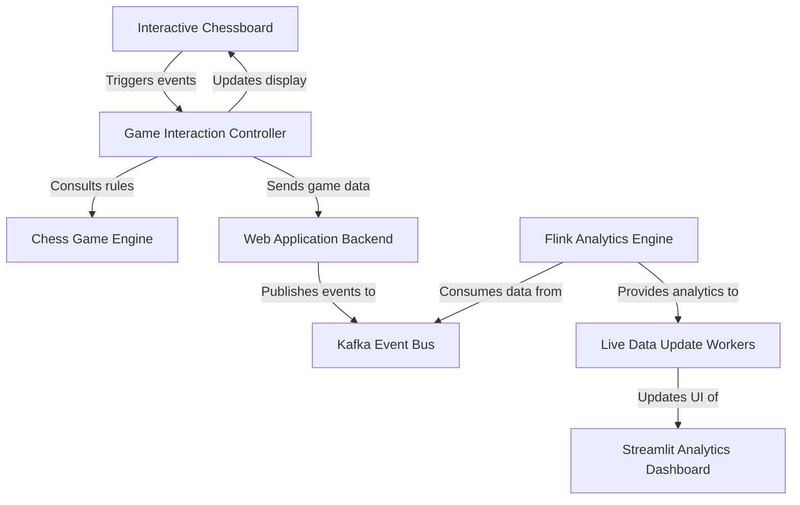

`kafka-chess` is a project that builds a **web-based chess game** with _real-time analytics_. Players interact with an _interactive chessboard_ via a web application, where every move and game event is published to a _Kafka event bus_. An _Apache Flink engine_ continuously processes these events to calculate live game statistics, which are then displayed on a dynamic _Streamlit dashboard_.

**Source Repository:** [https://github.com/cyshen11/kafka-chess](https://github.com/cyshen11/kafka-chess)

## Chapters

1. [Web Application Backend
   ](01_web_application_backend_.md)
2. [Interactive Chessboard
   ](02_interactive_chessboard_.md)
3. [Streamlit Analytics Dashboard
   ](03_streamlit_analytics_dashboard_.md)
4. [Game Interaction Controller
   ](04_game_interaction_controller_.md)
5. [Chess Game Engine
   ](05_chess_game_engine_.md)
6. [Kafka Event Bus
   ](06_kafka_event_bus_.md)
7. [Flink Analytics Engine
   ](07_flink_analytics_engine_.md)
8. [Live Data Update Workers
   ](08_live_data_update_workers_.md)

---

Generated by [AI Codebase Knowledge Builder](https://github.com/The-Pocket/Tutorial-Codebase-Knowledge)
